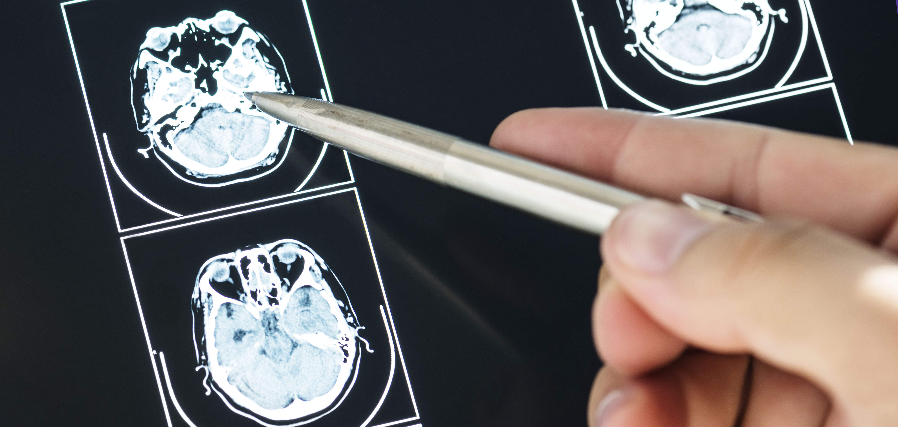

Aquí tienes el archivo `README.md` actualizado y adaptado con la nueva información proporcionada, manteniendo el estilo profesional, técnico y motivador establecido previamente, con **negritas** y *cursivas* para enfatizar puntos clave. He integrado los detalles del nuevo texto, como las técnicas avanzadas de aumento de datos (*cGAN*, *ProGAN*, *StyleGAN*), el estado actual del proyecto y los próximos pasos, asegurándome de que refleje el progreso y la visión de **BrainMorph** según el EDA y tus indicaciones.

---

# **BrainMorph**  
## *Plataforma de Análisis Avanzado de Imágenes Médicas para la Detección Temprana de Tumores Cerebrales*

## **Descripción del Proyecto**

**BrainMorph** es una plataforma *innovadora* diseñada para revolucionar el análisis y procesamiento de imágenes médicas, con un enfoque inicial en la **detección temprana de tumores cerebrales** mediante imágenes de resonancia magnética (*MRI*). En su primera fase, hemos desarrollado un *Notebook* que utiliza fuentes de datos *MRI* accesibles para implementar técnicas de **clasificación automática** y **análisis morfológico**, respaldado por un pipeline riguroso de limpieza y generación de datos sintéticos con inteligencia artificial avanzada.  

A diferencia de enfoques convencionales, nuestro sistema combina *aprendizaje profundo* con un análisis detallado de características físicas (*tamaño*, *forma*, *intensidad*), ofreciendo insights clínicos valiosos. En fases futuras, integraremos tomografías por emisión de positrones (*PET*) para ampliar el alcance a afecciones derivadas de inflamación o desplazamiento de la masa encefálica. Este trabajo sienta las bases para una solución **escalable**, con impacto directo en el diagnóstico temprano y un fuerte atractivo para hospitales, clínicas e *inversores*.

## **Técnicas de Aumento de Datos**

La escasez de datos médicos etiquetados es un desafío crítico en neuroimagen. En **BrainMorph**, lo superamos con un enfoque híbrido que combina métodos tradicionales y técnicas de vanguardia:

### *Técnicas Tradicionales de Aumento por Ruido*  
- **Transformaciones Geométricas e Intensidades:** *Rotaciones*, *traslaciones*, *escalado* y ajustes de *contraste*/*brillo* que simulan variaciones clínicas reales, preservando la integridad diagnóstica.  
- **GANs (Redes Generativas Adversarias):** Generación de imágenes sintéticas *realistas* que mantienen bordes y texturas esenciales de tumores.  
- **Modelos de Difusión:** Creación progresiva de imágenes de *alta calidad* mediante procesos de difusión inversa, ideales para enriquecer datasets con variabilidad controlada.

### *Técnicas Avanzadas y Modelos Propios*  
- **cGAN (GAN Condicional):** Generación dirigida por etiquetas (*glioma*, *meningioma*, etc.), creando imágenes personalizadas para patologías específicas.  
- **ProGAN:** Entrenamiento progresivo para producir imágenes de *alta resolución* con detalles anatómicos precisos.  
- **StyleGAN:** Separación de contenido y estilo, generando variaciones *realistas* que aumentan la diversidad sin perder utilidad clínica.  
- **Modelos de Difusión Avanzados:** Refinamiento continuo para imágenes complejas, adaptadas a necesidades clínicas específicas.

Estas técnicas no solo amplían nuestro dataset —alcanzando **500 imágenes sintéticas por categoría**—, sino que lo enriquecen con diversidad controlada, fortaleciendo la capacidad de generalización de nuestros modelos. Esto posiciona a **BrainMorph** como una solución *confiable* para entornos clínicos y un proyecto atractivo para *inversores*.

## **Estado Actual del Proyecto**

Estamos trabajando con múltiples fuentes de datos *MRI* abiertas, mientras avanzamos en solicitudes a instituciones para obtener imágenes *PET*. Nuestro pipeline actual incluye:  
- **Limpieza de Datos:** Verificación de integridad y resolución (*256x256 píxeles mínimo*), eliminación de duplicados con *phash*.  
- **Aumento Sintético:** Generación de datos con *ImageDataGenerator*, *GANs* simulados y modelos de difusión en `data/processed/`.  
- **Modelos Preliminares:** Clasificación de *gliomas*, *meningiomas*, *adenomas hipofisarios* y *sin tumor*, con análisis morfológico básico.  

Todo esto está documentado en el *Notebook* adjunto, que valida la viabilidad técnica de **BrainMorph** y nos prepara para escalar hacia un producto completo con impacto clínico significativo.

## **Procesos Clave: Verificación y Eliminación de Duplicados**

La **precisión** en la detección depende de un dataset *sin redundancias* y de **alta calidad**. Por ello, hemos implementado un proceso robusto para detectar y eliminar duplicados en `data/raw/`, abarcando *Training* y *Testing* para las categorías: **glioma**, **meningioma**, **notumor** y **pituitary**.

### *Metodología*  
- **Detección Inicial:** Probamos `average_hash`, pero resultó *demasiado sensible* a variaciones menores (*brillo*, *contraste*, *ruido*), descartando imágenes válidas.  
- **Optimización con phash:** Adoptamos `phash` (*Perceptual Hash*), basado en la transformada de coseno discreta (*DCT*), que captura características perceptuales esenciales con robustez clínica.  
  - Umbral de Hamming: **8**, equilibrando eliminación de redundancias y preservación de diversidad diagnóstica.  

El proceso:  
- Valida integridad y resolución (*256x256 píxeles mínimo*).  
- Aplica *phash* para identificar duplicados con precisión.  
- Mueve imágenes **únicas** a `data/preprocessed/`, manteniendo la estructura original.  

Resultados en `trazabilidad/02_verificacion_duplicados_resolucion_phash.csv`, con métricas de imágenes procesadas, corruptas, duplicadas y únicas. Este rigor metodológico asegura un dataset *limpio* y refuerza la *transparencia* para socios y reguladores.

## **Jupyter Notebook**

El *Notebook* adjunto (*EDA.ipynb*) incluye:  
- Procesamiento de imágenes *MRI*.  
- Aumento de datos (*tradicional*, *GANs*, *difusión*).  
- Clasificación preliminar y análisis morfológico (*tamaño en cm²*, *forma*).  
- Métricas de calidad de datos sintéticos.  

[Ver Notebook](notebooks/EDA.ipynb)

## **Próximos Pasos**

Nuestra hoja de ruta incluye:  
- **Integración de *PET***: Ampliar el análisis a nuevas modalidades.  
- **Modelos Avanzados:** Clasificación optimizada y estudio de efectos inflamatorios.  
- **Interfaz de Usuario:** Dashboard *intuitivo* con mapas de calor para médicos.  
- **Expansión del Aumento:** Técnicas adaptadas a inflamación y tumores raros.  

Estos avances consolidarán a **BrainMorph** como una solución *integral*, lista para clínicas y financiación significativa.

## **Contacto**

Para más información o colaboraciones:  
**[Pedro Ismael Ruiz Larrú](https://www.linkedin.com/in/pdro-ruiz/)**  
